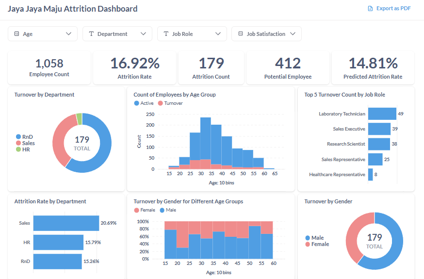
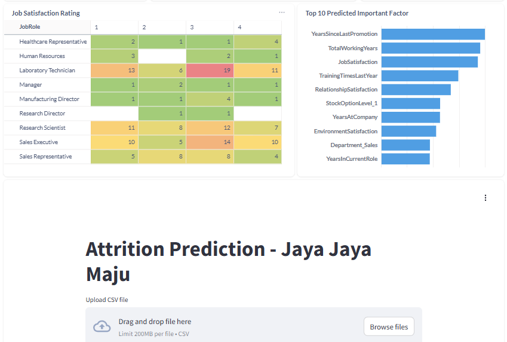
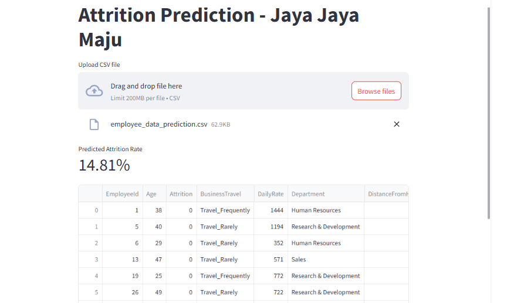

# Proyek Akhir: Menyelesaikan Permasalahan Perusahaan Edutech

## Business Understanding

Jaya Jaya Maju adalah perusahaan yang telah berkembang menjadi cukup besar di industri tempatnya beroperasi. Dengan skala bisnis yang semakin luas, tantangan dalam mengelola karyawan pun menjadi semakin kompleks. Perusahaan ini mungkin memiliki berbagai divisi, dari produksi hingga layanan pelanggan, yang semuanya memerlukan manajemen sumber daya manusia yang efektif.

### Permasalahan Bisnis

Walaupun telah menjadi menjadi perusahaan yang cukup besar, Jaya Jaya Maju masih cukup kesulitan dalam mengelola karyawan. Hal ini berimbas tingginya attrition rate (rasio jumlah karyawan yang keluar dengan total karyawan keseluruhan) hingga lebih dari 10%. Berikut adalah pemetaan permasalahan bisnis yang terjadi di perusahaan ini.

### 1. **Pemetaan Pola Karyawan yang Keluar (Attrition Pattern)**
- **Variabel relevan**: `Age`, `DistanceFromHome`, `Education`, `JobSatisfaction`, `EnvironmentSatisfaction`, `WorkLifeBalance`, `YearsAtCompany`
- **Manfaat bisnis**: Menemukan karakteristik umum karyawan yang cenderung resign → bisa digunakan untuk **deteksi dini** risiko attrition.

### 2. **Optimalisasi Strategi Retensi Karyawan**
- **Variabel relevan**: `JobInvolvement`, `RelationshipSatisfaction`, `WorkLifeBalance`, `YearsSinceLastPromotion`, `TrainingTimesLastYear`
- **Manfaat bisnis**: Mengidentifikasi celah dalam keterlibatan kerja, hubungan interpersonal, pelatihan, dan peluang promosi → jadi dasar buat perbaikan program HR agar karyawan **betah dan berkembang**.

### 3. **Evaluasi dan Optimalisasi Kompensasi dan Benefit**
- **Variabel relevan**: `MonthlyIncome`, `HourlyRate`, `DailyRate`, `PercentSalaryHike`, `StockOptionLevel`, `JobLevel`, `PerformanceRating`
- **Manfaat bisnis**: Menilai apakah sistem kompensasi sudah **adil dan kompetitif**, terutama pada kelompok karyawan dengan risiko tinggi keluar.


### 4. **Pemetaan Risiko Turnover Berdasarkan Jabatan dan Divisi**
- **Variabel relevan**: `Department`, `JobRole`, `JobLevel`, `YearsInCurrentRole`, `TotalWorkingYears`
- **Manfaat bisnis**: Mengidentifikasi divisi/jabatan dengan turnover tinggi → bisa dilakukan penyesuaian manajerial atau operasional yang tepat sasaran.


### 5. **Analisis Beban Kerja dan Work-Life Balance**
- **Variabel relevan**: `OverTime`, `WorkLifeBalance`, `EnvironmentSatisfaction`, `DistanceFromHome`, `StandardHours`
- **Manfaat bisnis**: Menilai apakah beban kerja berlebihan atau jarak kerja memengaruhi kesehatan mental dan keputusan untuk resign → landasan untuk program **well-being** atau fleksibilitas kerja.


### 6. **Evaluasi Efektivitas Manajer dalam Retensi Karyawan**
- **Variabel relevan**: `YearsWithCurrManager`, `JobInvolvement`, `PerformanceRating`, `RelationshipSatisfaction`
- **Manfaat bisnis**: Menganalisis apakah **gaya kepemimpinan atau kepuasan hubungan** dengan atasan berkontribusi terhadap keputusan keluar karyawan.


### 7. **Deteksi Potensi Resign Berdasarkan Perjalanan Karier**
- **Variabel relevan**: `NumCompaniesWorked`, `YearsSinceLastPromotion`, `YearsAtCompany`, `YearsInCurrentRole`
- **Manfaat bisnis**: Mengukur stagnasi karier sebagai pemicu resign, dan menyusun **jalur karier yang lebih atraktif** bagi karyawan.


### Cakupan Proyek

Proyek ini bertujuan untuk menganalisis faktor-faktor utama yang memengaruhi keputusan karyawan untuk resign (attrition) di perusahaan Jaya Jaya Maju serta membangun model prediktif berbasis machine learning guna mengidentifikasi karyawan yang berisiko tinggi untuk keluar di masa depan. Analisis akan dilakukan menggunakan data internal karyawan yang mencakup aspek demografi, kepuasan kerja, kompensasi, perjalanan karier, serta hubungan antarindividu dalam organisasi. Proyek mencakup proses data understanding, data preprocessing, pemodelan klasifikasi dengan SVM classification, evaluasi performa model, serta penyusunan rekomendasi berbasis data untuk optimalisasi strategi retensi karyawan. Cakupan proyek dibatasi pada data yang disediakan tanpa mempertimbangkan faktor eksternal di luar perusahaan.

### Persiapan

Sumber data: [Watson Analytics Use Case for HR Retaining Valuable Employees](https://www.ibm.com/communities/analytics/watson-analytics-blog/watson-analytics-use-case-for-hr-retaining-valuable-employees/)

Template: [Download di sini](https://github.com/dicodingacademy/a590-Belajar-Penerapan-Data-Science/tree/a590_proyek_pertama/a590_proyek_pertama)

Setup environment:

```
python -m venv .venv

.venv\Scripts\activate

pip install -r requirements.txt
```

## Business Dashboard





Dashboard bisa diakses pada link [berikut](https://metabase-production-469c.up.railway.app/public/dashboard/c4b5a4b9-1231-4841-9dec-8f00a1c48449). Dashboard ini merupakan hasil akhir dari proyek analitik prediktif untuk memahami dan mengantisipasi tingginya tingkat attrition (karyawan yang keluar) di perusahaan Jaya Jaya Maju. Berdasarkan data yang dianalisis, perusahaan memiliki total 1.058 karyawan, dengan attrition rate aktual sebesar 16.92%, atau setara dengan 179 orang yang telah keluar dalam periode yang dianalisis.

Sementara itu, dari sisi pemodelan prediktif, sistem memperkirakan attrition rate sebesar 14.81% pada 412 karyawan potensial berdasarkan model machine learning menggunakan Support Vector Machine (SVM) dengan performa yang cukup baik (akurasi 89.77%, presisi 96.32%, recall 83.96%, dan F1-score 89.71%). Prediction app bisa diakses dalam link [berikut](https://deploy-app-jaya-jaya-maju-production.up.railway.app/).

Lebih lanjut, analisis dilakukan secara mendalam berdasarkan karakteristik umum karyawan, mencakup departemen, kelompok usia, jenis pekerjaan, dan gender, guna mengidentifikasi kelompok yang paling rentan terhadap attrition.

#### **1. Berdasarkan Departemen**
Visualisasi menunjukkan bahwa departemen **Sales** merupakan kontributor terbesar terhadap jumlah turnover, dengan **attrition rate tertinggi sebesar 20.69%**, diikuti oleh HR (**15.79%**) dan R&D (**15.26%**). Hal ini menunjukkan bahwa departemen Sales menghadapi tantangan signifikan dalam mempertahankan tenaga kerja, yang mungkin terkait dengan tekanan kerja, target, atau kurangnya dukungan pengembangan karier.

#### **2. Berdasarkan Kelompok Usia**
Distribusi karyawan terbanyak berada pada rentang usia **30–40 tahun**, namun attrition paling banyak terjadi pada kelompok usia **25–35 tahun**. Ini menandakan bahwa karyawan usia muda dan awal karier relatif lebih tidak stabil dan cenderung berpindah kerja, yang dapat berkaitan dengan ekspektasi karier, kompensasi, atau work-life balance.

#### **3. Berdasarkan Job Role**
Lima posisi pekerjaan dengan jumlah turnover tertinggi adalah:
- **Laboratory Technician** (49 orang)
- **Sales Executive** (39 orang)
- **Research Scientist** (38 orang)
- **Sales Representative** (25 orang)
- **Healthcare Representative** (8 orang)

Dari data ini terlihat bahwa pekerjaan dengan beban teknis tinggi atau tekanan target, terutama di bidang laboratorium dan sales, menjadi kelompok rentan terhadap attrition. Hal ini mengindikasikan perlunya evaluasi terhadap keseimbangan beban kerja dan kompensasi di jabatan-jabatan tersebut.

#### **4. Berdasarkan Gender**
Secara keseluruhan, **karyawan laki-laki menyumbang porsi terbesar dari angka attrition**, yakni sekitar 60% dari total karyawan yang keluar. Namun, jika dilihat berdasarkan kelompok usia, attrition perempuan terlihat **lebih tinggi di rentang usia muda (20–25 tahun)**, yang dapat mencerminkan kebutuhan untuk menciptakan lingkungan kerja yang lebih fleksibel dan mendukung bagi karyawan perempuan yang baru menyelesaikan pendidikan tingginya dan memulai karir.

#### **5. Berdasarkan Tingkat Kepuasan Kerja (Job Satisfaction)**
Berdasarkan hasil pemodelan, **job satisfaction** muncul sebagai salah satu faktor terpenting dalam memprediksi kemungkinan karyawan resign, bersama dengan `YearsSinceLastPromotion`, `TotalWorkingYears`, dan `TrainingTimesLastYear`. Oleh karena itu, dilakukan analisis lanjutan untuk melihat distribusi tingkat kepuasan kerja berdasarkan jenis pekerjaan (job role).

Dari visualisasi **Job Satisfaction Rating**, terlihat bahwa posisi seperti **Sales Executive**, **Sales Representative**, **Laboratory Technician**, dan **Research Scientist** memiliki tingkat kepuasan kerja yang relatif rendah. Terutama pada **Laboratory Technician**, terlihat konsentrasi tinggi pada skor 2 dan 3, bahkan ada sejumlah karyawan yang memberikan skor 1 (sangat tidak puas). Hal serupa juga terlihat pada posisi sales, di mana mayoritas karyawan memberi nilai hanya 2 atau 3 dari skala 4, dengan sangat sedikit yang memberi nilai 4 (sangat puas).

Temuan ini memperkuat dugaan bahwa **kepuasan kerja yang rendah pada posisi tertentu, terutama yang berhubungan dengan tekanan teknis atau target penjualan, merupakan pemicu utama attrition.**

Sebagai tambahan, dashboard ini juga terhubung dengan Streamlit app yang bisa digunakan untuk memprediksi attrition rate karyawan di masa depan.

## Conclusion


Secara keseluruhan, hasil analisis menunjukkan bahwa **Sales Department**, **karyawan usia muda**, serta jabatan dengan **tekanan target atau beban teknis tinggi** (seperti sales dan lab technician) merupakan kelompok yang paling rentan terhadap turnover. Salah satu faktor dominan adalah **tingkat kepuasan kerja yang rendah**, yang terbukti relevan baik secara statistik dalam model prediksi maupun secara visual dalam distribusi antar job role.

Selain itu, faktor-faktor lain seperti **jarangnya promosi (YearsSinceLastPromotion)**, **pengalaman kerja total**, **jumlah pelatihan**, serta **hubungan interpersonal dan pemberian insentif (stock option)** juga memainkan peran penting dalam menentukan keputusan resign. Oleh karena itu, **strategi retensi yang efektif perlu diarahkan pada peningkatan kepuasan kerja, pengembangan karier yang transparan, serta program insentif dan pelatihan yang lebih merata**, khususnya untuk posisi yang teridentifikasi rawan.

### Rekomendasi Action Items (Optional)

- Fokuskan program retensi pada departemen Sales dan Laboratorium yang menunjukkan tingkat attrition dan ketidakpuasan kerja tertinggi.
- Tingkatkan kepuasan kerja melalui survei berkala dan tindak lanjut konkret di posisi Sales Executive dan Lab Technician.
- Bangun budaya kerja yang mendukung work-life balance terutama untuk karyawan usia 25–35 tahun, terlebih perempuan yang baru memulai karir.
- Lakukan analisis lanjutan untuk mengeksplorasi lebih dalam, terutama terkait beberapa faktor yang menurut model prediksi paling penting, seperti mengevaluasi dan memperluas program promosi karier terutama untuk karyawan dengan masa kerja panjang tanpa kenaikan jabatan (kaitannya dengan `YearsSinceLastPromotion` dan `TotalWorkingYears`).